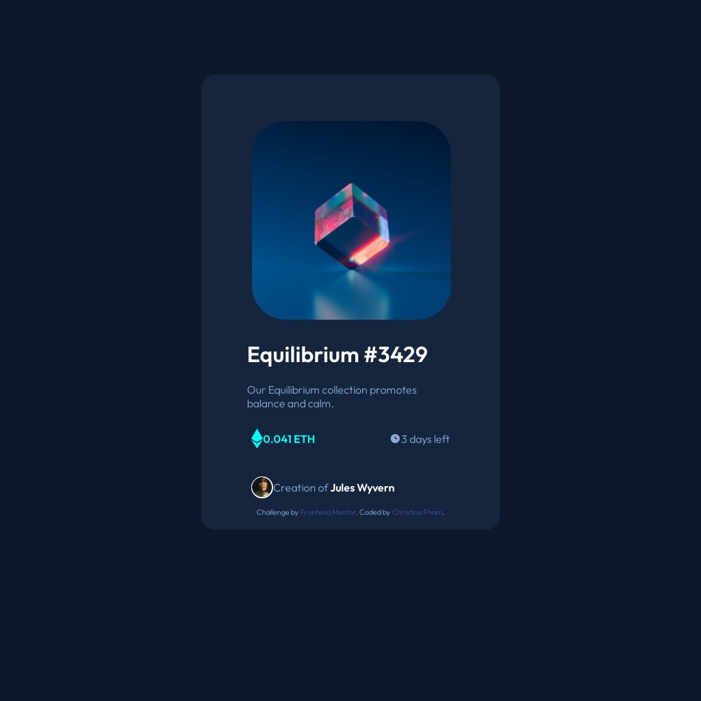

# Frontend Mentor - NFT preview card component solution

This is a solution to the [NFT preview card component challenge on Frontend Mentor](https://www.frontendmentor.io/challenges/nft-preview-card-component-SbdUL_w0U). Frontend Mentor challenges help you improve your coding skills by building realistic projects. 

## Table of contents

- [Overview](#overview)
  - [The challenge](#the-challenge)
  - [Screenshot](#screenshot)
  - [Links](#links)
- [My process](#my-process)
  - [Built with](#built-with)
  - [What I learned](#what-i-learned)
  - [Continued development](#continued-development)
- [Author](#author)


## Overview

### The challenge

Users should be able to:

- View the optimal layout depending on their device's screen size
- See hover states for interactive elements

### [Screenshot](img/screenshot.jpg)



### Links

- Solution URL: [https://github.com/ChristineCPham/nft-preview-card](https://github.com/ChristineCPham/nft-preview-card)
- Live Site URL: [https://christinecpham.github.io/nft-preview-card/](https://christinecpham.github.io/nft-preview-card/)

## My process

### Built with

- Semantic HTML5 markup
- CSS custom properties
- Flexbox
- Mobile-first workflow

### What I learned

Through this project, I learned how to create overlays on images and how to center elements both horizontally and vertically. I also learned how to make elements appear visible only when they are being hovered over.


**HTML**
```html
  <div class="nft-img-container">
  
  

  <div class="icon">
    
  </div>
  </div>
```


**CSS**
```css
.icon {
    position: absolute;
    top: 50%;
    left: 50%;
    transform: translate(-50%, -50%);
    height: 100%;
    width: 100%;
    opacity: 0;
    background-color: var(--cyan-transparent);
    border: .01em solid transparent;
    border-radius: 5vh;
}

.nft-img-container:hover .icon {
    opacity: 1;
    border: .01em solid transparent;
    border-radius: 5vh;
}
```

### Continued development

In the future, I will continue learning responsive design and how to create an excellent user experience.

## Author

- Frontend Mentor - [@ChristineCPham](https://www.frontendmentor.io/profile/ChristineCPham)
- LinkedIn - [Christine Pham](https://www.linkedin.com/in/christine-p-b456751a6/)
